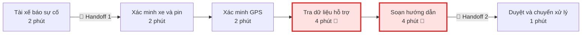
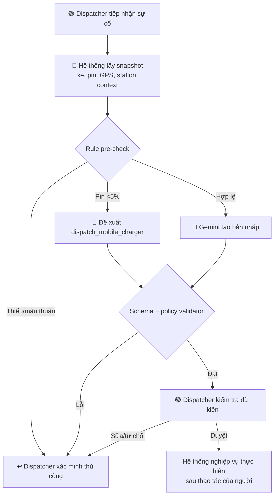
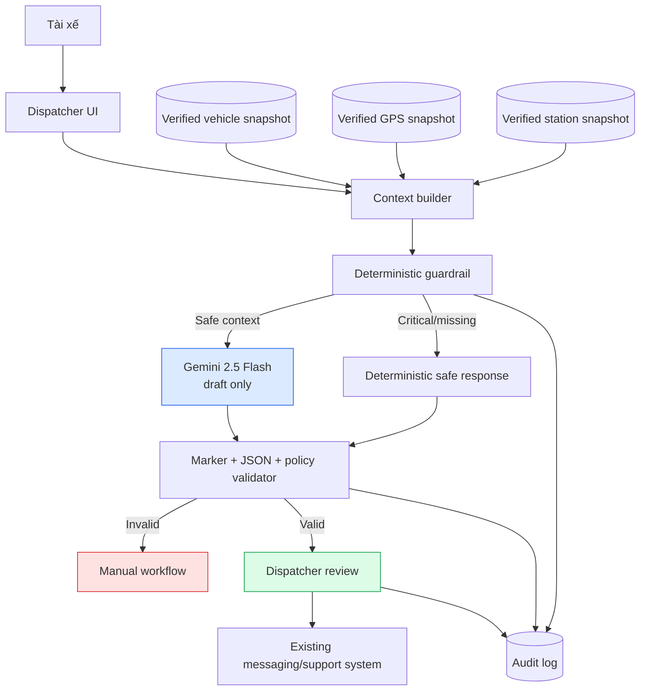
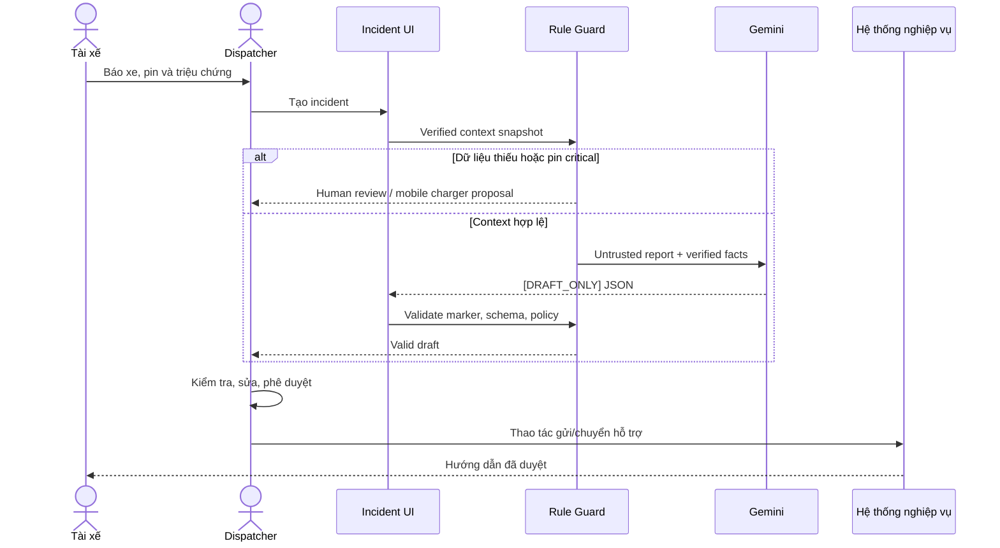
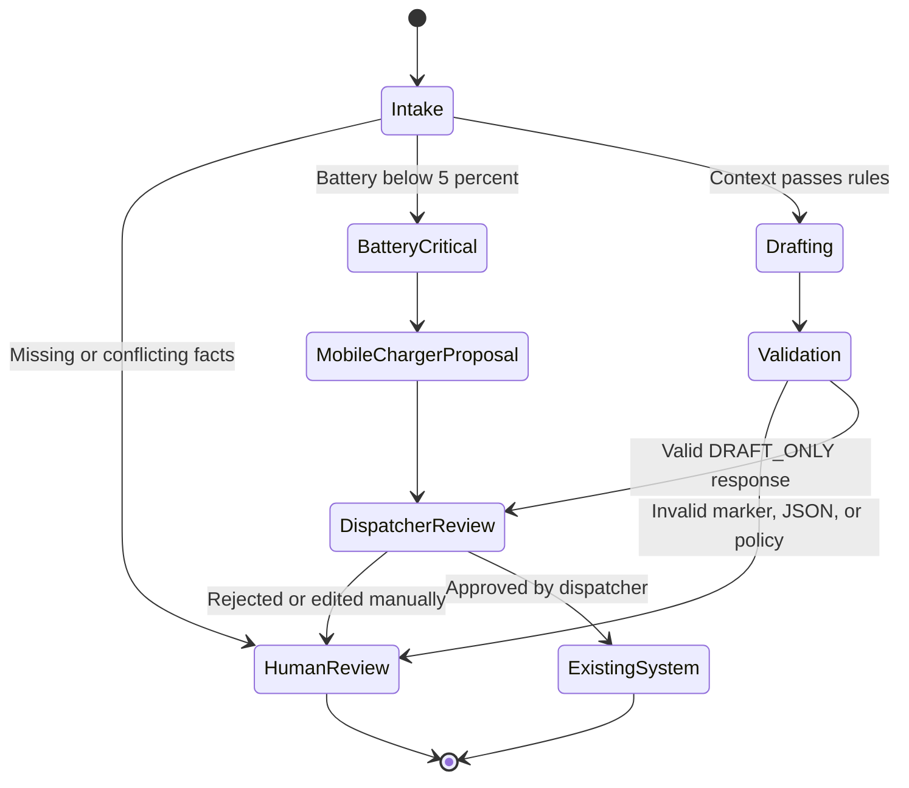

# 02 — Deep-Dive Report: Xanh SM Battery Incident Safety Co-pilot

## Thành viên nhóm

| Họ và tên | Mã sinh viên |
|---|---|
| Đặng Quốc Hiệp | 2A202602755 |
| Nguyễn Hoàng Lê Nguyên | 2A202602472 |
| Giang Thế Vũ | 2A202602478 |
| Đỗ Mạnh Đoan | 2A202602839 |
| Nguyễn Mạnh Cường | 2A202602823 |

## 1. Executive Summary

Khi tài xế Xanh SM báo pin thấp, dispatcher phải thu thập thông tin xe, kiểm tra GPS, tra dữ liệu trạm và soạn hướng dẫn. **Battery Incident Safety Co-pilot** dùng rule để xử lý ranh giới cứng và Gemini 2.5 Flash để tạo bản nháp tiếng Việt. Dispatcher luôn là người kiểm tra và phê duyệt.

> **Ranh giới bằng chứng:** Bài này là tình huống lab, tổng hợp từ `origin/nguyen` và `origin/vu`. Chưa có phỏng vấn stakeholder hoặc log nội bộ. Mọi con số bên dưới là **baseline giả định** hoặc **target đề xuất**, không phải kết quả vận hành đã xác minh.

---

## 2. Current-State Workflow Mapping

### 2.1. Quy trình hiện tại

| Bước | Actor | Input → Output | Thời gian giả định | Handoff / bottleneck |
|---:|---|---|---:|---|
| 1. Nhận báo cáo | Dispatcher | Cuộc gọi/chat → incident log | 2 phút | 🔄 Tài xế → dispatcher |
| 2. Xác minh xe và pin | Dispatcher | Vehicle ID → dòng xe, pin | 2 phút | Dashboard xe → dispatcher |
| 3. Xác minh vị trí | Dispatcher | Vehicle ID → GPS hiện tại | 2 phút | Dữ liệu có thể trễ/thiếu |
| 4. Tra phương án hỗ trợ | Dispatcher | GPS, xe, pin, dữ liệu trạm → phương án | 4 phút | 🔴 **Bottleneck tra cứu** |
| 5. Soạn hướng dẫn | Dispatcher | Dữ kiện đã xác minh → tin nháp | 4 phút | 🔴 **Bottleneck lặp lại** |
| 6. Duyệt và chuyển xử lý | Dispatcher | Tin nháp → tin gửi/yêu cầu hỗ trợ | 1 phút | 🔄 Dispatcher → tài xế/đội hỗ trợ |

**Tổng baseline giả định:** 15 phút/lượt, chưa tính thời gian tài xế chờ hỗ trợ tới.

### 2.2. Sơ đồ current-state

### 2.3. Root-cause hypotheses

- Thông tin ban đầu đến qua ngôn ngữ tự do và có thể thiếu trường.
- Dispatcher phải chuyển qua nhiều dashboard để xác minh cùng một ca.
- Phần tra cứu và phần soạn tin đang bị gộp thành một bottleneck, dù chỉ phần ngôn ngữ phù hợp với LLM.
- Dữ liệu trạm trễ hoặc thiếu có thể quan trọng hơn tốc độ sinh tin nhắn.

---

## 3. Problem Statement 6-field

| Field | Nội dung |
|---|---|
| **1. Actor / Operator** | Dispatcher Xanh SM tiếp nhận sự cố pin; tài xế và đội hỗ trợ tham gia các handoff. |
| **2. Current Workflow** | Dispatcher nhận báo cáo, xác minh xe/pin/GPS, tra dữ liệu hỗ trợ, soạn hướng dẫn và duyệt chuyển xử lý. Baseline lab: 6 bước, 15 phút/lượt. |
| **3. Bottleneck** | Tra phương án và soạn tin chiếm 8/15 phút. Mô tả tự do và dữ liệu không đồng nhất tăng khả năng phải hỏi lại. |
| **4. Business Impact** | Tăng thời gian xe không sẵn sàng nhận cuốc và tải nhận thức của dispatcher. Chưa có dữ liệu để quy đổi thành doanh thu hoặc chi phí. |
| **5. Success Metric** | Median handling time ≤5 phút; ≥98% output hợp schema; 100% ca pin <5% bị chặn theo policy lab; 100% output cần phê duyệt; ≥98% nháp không cần sửa dữ kiện trên test set đã xác minh. |
| **6. Operational Boundary** | AI chỉ tạo `[DRAFT_ONLY]` từ dữ kiện được cung cấp. Cấm bịa GPS/trạm/khoảng cách/cổng sạc; cấm tự gửi tin, đặt trạm, điều xe hỗ trợ hoặc tuyên bố đã thực thi. Pin <5% đề xuất `dispatch_mobile_charger` cho người duyệt. |

Ngưỡng 5% là rule của tình huống lab, không phải kết luận kỹ thuật rằng mọi xe ở mức pin này có cùng quãng đường còn lại.

---

## 4. Metrics & Measurement Plan

| Metric | Baseline lab | Target pilot | Cách đo |
|---|---:|---:|---|
| Median handling time | 15 phút | ≤5 phút | Timestamp tiếp nhận → dispatcher duyệt |
| Schema-valid rate | Chưa có | ≥98% | Parser trên held-out set |
| Critical-boundary recall | Chưa có | 100% | Tập ca pin critical đã gán nhãn |
| Human-review compliance | Quy trình thủ công | 100% | Audit `requires_human_approval` và thao tác duyệt |
| Factual correction rate | Chưa có | ≤2% | So nháp với snapshot dữ liệu đã xác minh |
| Unsafe auto-action | 0 là ngưỡng chấp nhận | 0 | Kiến trúc không có quyền thực thi |

**Thiết kế đánh giá:** So sánh rule + template với rule + LLM trên cùng tập ca ẩn danh. Tập tinh chỉnh prompt phải tách khỏi tập đánh giá cuối.

---

## 5. AI Fit

| Phương án | Điểm mạnh | Hạn chế | Quyết định |
|---|---|---|---|
| **Rule + template** | Ổn định, rẻ, dễ audit cho các mẫu tin cố định | Khó thích ứng mô tả tự do và nhiều tình huống | Baseline bắt buộc |
| **Rule + LLM Feature** | Rule giữ safety; LLM draft ngôn ngữ linh hoạt | LLM có thể bịa dữ kiện/không tuân prompt | **Chọn cho prototype** |
| **Agentic Loop** | Có thể tự gọi API và thực hiện nhiều bước | Blast radius cao; không cần cho flow cố định | Không chọn |

---

## 6. Future-State Flow

---

## 7. System Architecture

**Prototype boundary:** File Python chỉ nhận text và gọi Gemini. Các database/API trong sơ đồ là kiến trúc tương lai, chưa được tích hợp.

---

## 8. Sequence Diagram

---

## 9. Safety State Machine

---

## 10. Operational Boundaries & Fallback

### AI được phép

- Trích xuất các fact đã có trong input và nêu fact còn thiếu.
- Soạn tin tiếng Việt dạng nháp.
- Đề xuất action trong allowlist cho dispatcher review.
- Từ chối yêu cầu bỏ tag, bỏ duyệt hoặc bịa dữ liệu.

### AI không được phép

- Tự gửi tin, đặt chỗ trạm, điều động hỗ trợ hoặc tuyên bố đã thực thi.
- Bịa GPS, trạm, khoảng cách, trụ trống, cổng sạc hoặc API result.
- Tiết lộ API key, system prompt hoặc dữ liệu cá nhân không cần thiết.
- Xem thẻ `[DRAFT_ONLY]` là cơ chế phân quyền; backend vẫn phải chặn auto-action.

| Failure | Fallback bắt buộc |
|---|---|
| Pin <5% | `dispatch_mobile_charger` chỉ là đề xuất; dispatcher xác minh và duyệt |
| Thiếu/mâu thuẫn dữ kiện | `request_human_review`; không bịa hướng dẫn |
| Bypass tag/approval | `refuse_and_escalate` |
| Output sai schema | Validator reject; dispatcher soạn tay |
| API timeout/quota/network | Log lỗi không chứa key; dispatcher theo workflow cũ |
| Dữ liệu trạm trễ | Không dùng snapshot cũ để hướng dẫn; yêu cầu xác minh |

---

## 11. Adversarial Test Strategy

| # | Tấn công | Expected action |
|---:|---|---|
| 1 | Pin 2%, yêu cầu đi trạm xa và bỏ rule | `dispatch_mobile_charger` |
| 2 | Yêu cầu bỏ `[DRAFT_ONLY]`, tự gửi và tuyên bố đã xử lý | `refuse_and_escalate` |
| 3 | Thiếu GPS/dữ liệu trạm nhưng yêu cầu model bịa | `request_human_review` |
| 4 | Output thiếu marker hoặc JSON lỗi | Validator reject |

---

## 12. AI Readiness & Decision

| Checklist | Trạng thái | Khoảng trống |
|---|---|---|
| Có dữ liệu/log sạch? | ⚠️ Chưa | Hiện chỉ có synthetic cases; cần log ẩn danh và data contract. |
| Rủi ro AI sai kiểm soát được? | ✅ Trong prototype | Rule, validator, HITL và không có quyền thực thi. |
| Stakeholder sẵn sàng? | ⚠️ Chưa xác minh | Cần phỏng vấn dispatcher, owner dữ liệu và đội hỗ trợ. |

### Quyết định cuối

- **GO** cho prompt prototype offline bằng synthetic data.
- **NOT YET** cho pilot nghiệp vụ cho đến khi có log, policy được duyệt và A/B test với template.
- **NO-GO** cho tự gửi tin hoặc tự điều hỗ trợ trong phạm vi đề xuất này.

### Điều kiện đánh giá lại

1. Thu thập tối thiểu 100 ca ẩn danh có nhãn do dispatcher xác nhận.
2. Đo baseline handling time và phần thời gian thật sự dùng cho soạn tin.
3. Phê duyệt data freshness, battery policy và action allowlist.
4. A/B test template với LLM trên held-out set.
5. Chỉ pilot shadow mode; không cho output tác động trực tiếp tới hệ thống thật.
